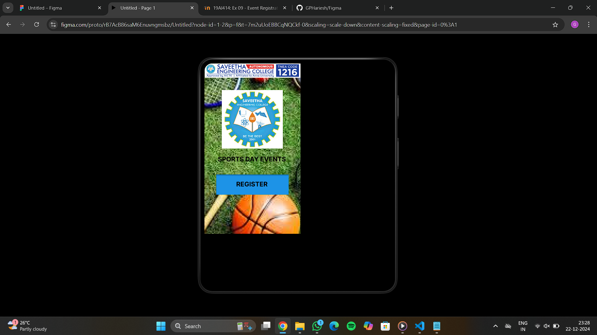
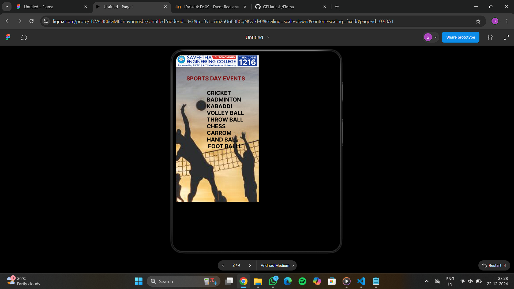
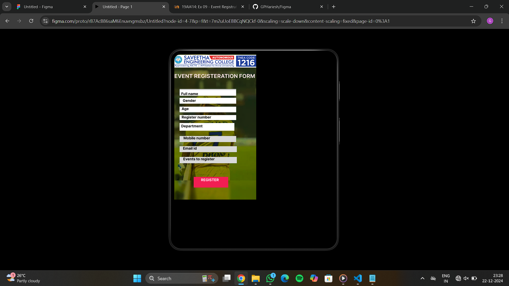
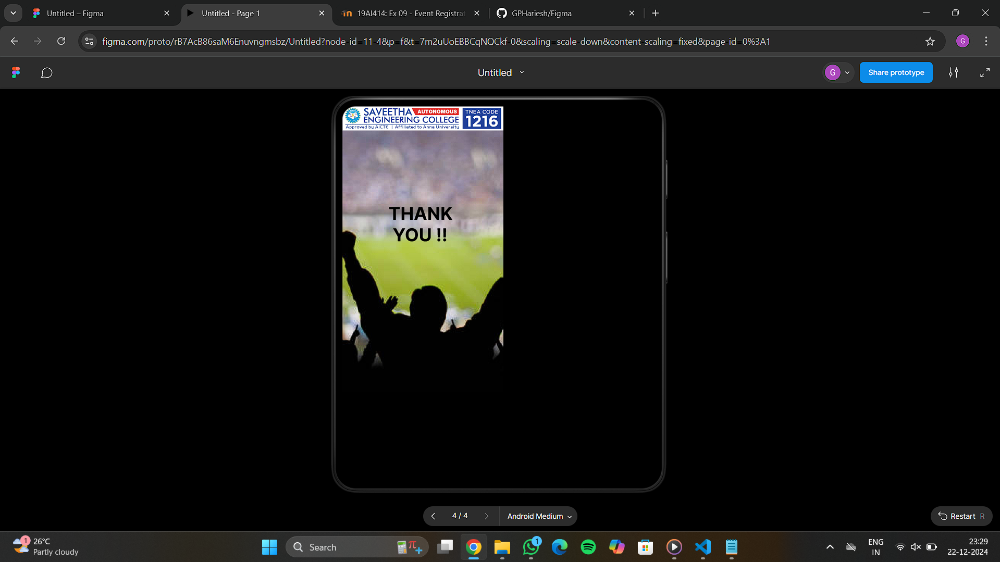

# Ex09 Event Registration Web Application
## Date:22-12-24

## AIM:
To design, develop and deploy a web application for event registration.

## DESIGN STEPS:

### Step 1:
Create a new frame.

### Step 2:
Select any one preset size of your choice.

### Step 3:
Select the shapes you need.

### Step 4:
Import images as needed.

### Step 5:
Create pages based on your need and link them.

### Step 6:

Validate the HTML and CSS code.

### Step 6:

Publish the website in the given URL.

## DESIGN TOOL:
Figma

## CODE:
```
page 1

<div class="container--0-">
    <svg
      width="272"
      height="76"
      viewBox="0 0 272 76"
      fill="none"
      xmlns="http://www.w3.org/2000/svg"
    >
      <g filter="url(#filter0_i_1_3)">
        <path d="M0 0H136H272V76H0V0Z" fill="#1D93E7"></path>
      </g>
      <defs>
        <filter
          id="filter0_i_1_3"
          x="0"
          y="0"
          width="272"
          height="80"
          filterUnits="userSpaceOnUse"
          color-interpolation-filters="sRGB"
        >
          <feFlood flood-opacity="0" result="BackgroundImageFix"></feFlood>
          <feBlend
            mode="normal"
            in="SourceGraphic"
            in2="BackgroundImageFix"
            result="shape"
          ></feBlend>
          <feColorMatrix
            in="SourceAlpha"
            type="matrix"
            values="0 0 0 0 0 0 0 0 0 0 0 0 0 0 0 0 0 0 127 0"
            result="hardAlpha"
          ></feColorMatrix>
          <feOffset dy="4"></feOffset>
          <feGaussianBlur stdDeviation="2"></feGaussianBlur>
          <feComposite
            in2="hardAlpha"
            operator="arithmetic"
            k2="-1"
            k3="1"
          ></feComposite>
          <feColorMatrix
            type="matrix"
            values="0 0 0 0 0 0 0 0 0 0 0 0 0 0 0 0 0 0 0.25 0"
          ></feColorMatrix>
          <feBlend
            mode="normal"
            in2="shape"
            result="effect1_innerShadow_1_3"
          ></feBlend>
        </filter>
      </defs>
    </svg>
    <div class="text-0-1-3">REGISTER</div>
    
  </div>

  page 2

  <div class="container--0-">
  
  <div class="text-0-1-1">SPORTS DAY EVENTS</div>
  <div class="text-0-1-2">
    CRICKET <br />
    BADMINTON<br />
    KABADDI <br />
    VOLLEY BALL<br />
    THROW BALL<br />
    CHESS <br />
    CARROM<br />
    HAND BALL<br />
    FOOT BALLL
  </div>
  
</div>

page 3

<div class="container--0-">
  
  <div class="text-0-1-3">EVENT REGISTERATION FORM</div>
  <div class="text-0-1-4">FULL NAME<br /></div>
  <svg
    width="249"
    height="30"
    viewBox="0 0 249 30"
    fill="none"
    xmlns="http://www.w3.org/2000/svg"
  >
    <g filter="url(#filter0_i_8_6)">
      <rect width="249" height="30" fill="white"></rect>
    </g>
    <defs>
      <filter
        id="filter0_i_8_6"
        x="0"
        y="0"
        width="249"
        height="34"
        filterUnits="userSpaceOnUse"
        color-interpolation-filters="sRGB"
      >
        <feFlood flood-opacity="0" result="BackgroundImageFix"></feFlood>
        <feBlend
          mode="normal"
          in="SourceGraphic"
          in2="BackgroundImageFix"
          result="shape"
        ></feBlend>
        <feColorMatrix
          in="SourceAlpha"
          type="matrix"
          values="0 0 0 0 0 0 0 0 0 0 0 0 0 0 0 0 0 0 127 0"
          result="hardAlpha"
        ></feColorMatrix>
        <feOffset dy="4"></feOffset>
        <feGaussianBlur stdDeviation="2"></feGaussianBlur>
        <feComposite
          in2="hardAlpha"
          operator="arithmetic"
          k2="-1"
          k3="1"
        ></feComposite>
        <feColorMatrix
          type="matrix"
          values="0 0 0 0 0 0 0 0 0 0 0 0 0 0 0 0 0 0 0.25 0"
        ></feColorMatrix>
        <feBlend
          mode="normal"
          in2="shape"
          result="effect1_innerShadow_8_6"
        ></feBlend>
      </filter>
    </defs>
  </svg>
  <div class="text-0-1-7">Full name</div>
  <svg
    width="249"
    height="26"
    viewBox="0 0 249 26"
    fill="none"
    xmlns="http://www.w3.org/2000/svg"
  >
    <rect width="249" height="26" fill="white"></rect></svg
  ><svg
    width="249"
    height="25"
    viewBox="0 0 249 25"
    fill="none"
    xmlns="http://www.w3.org/2000/svg"
  >
    <rect width="249" height="25" fill="white"></rect>
  </svg>
  <div class="text-0-1-11">Age</div>
  <svg
    width="249"
    height="22"
    viewBox="0 0 249 22"
    fill="none"
    xmlns="http://www.w3.org/2000/svg"
  >
    <rect width="249" height="22" fill="white"></rect>
  </svg>
  <div class="text-0-1-13">Register number</div>
  <div class="text-0-1-14">Gender</div>
  <svg
    width="241"
    height="34"
    viewBox="0 0 241 34"
    fill="none"
    xmlns="http://www.w3.org/2000/svg"
  >
    <rect width="241" height="34" fill="white"></rect>
  </svg>
  <div class="text-0-1-16">Department</div>
  <svg
    width="249"
    height="27"
    viewBox="0 0 249 27"
    fill="none"
    xmlns="http://www.w3.org/2000/svg"
  >
    <rect width="249" height="27" fill="#D9D9D9"></rect>
  </svg>
  <div class="text-0-1-18">Mobile number</div>
  <svg
    width="252"
    height="26"
    viewBox="0 0 252 26"
    fill="none"
    xmlns="http://www.w3.org/2000/svg"
  >
    <rect width="252" height="26" fill="#D9D9D9"></rect>
  </svg>
  <div class="text-0-1-20">Email id</div>
  <svg
    width="252"
    height="28"
    viewBox="0 0 252 28"
    fill="none"
    xmlns="http://www.w3.org/2000/svg"
  >
    <rect width="252" height="28" fill="#D9D9D9"></rect>
  </svg>
  <div class="text-0-1-22">Events to register</div>
  <svg
    width="152"
    height="47"
    viewBox="0 0 152 47"
    fill="none"
    xmlns="http://www.w3.org/2000/svg"
  >
    <rect width="152" height="47" fill="#F21E53"></rect>
  </svg>
  <div class="text-0-1-24">REGISTER</div>
  
</div>

page 4

<div class="container--0-">
  
  <div class="text-0-1-2">
    THANK <br/>
    YOU !!
  </div>
</div>

```

## OUTPUT:




## RESULT:
The program to design, develop and deploy a web application for event registration is completed successfully.
